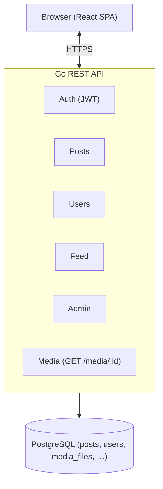
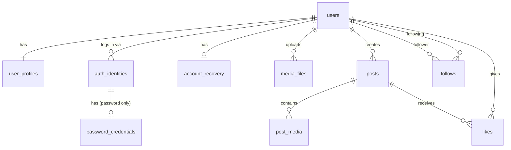

# Ephemeral

Ephemeral is a social media platform dedicated exclusively to photographs of **places** — everyday landscapes people walk past without noticing, remote corners of the world, and the quiet scenery that shapes our surroundings. Personal portraits, animal photography, and any content not centred on an existing physical location are out of scope by design. The goal is to build a focused, distraction-free space where the place is always the subject.

---

## Table of Contents

1. [Milestones](#milestones)
2. [Functional Requirements](#functional-requirements)
3. [Non-Functional Requirements](#non-functional-requirements)
4. [System Architecture](#system-architecture)
5. [Database Architecture](#database-architecture)
6. [Project Steps](#project-steps)

---

## Milestones

### Milestone 1 — Monolithic Foundation
A fully working social media product built on a straightforward, single-server architecture:

- **Frontend**: React (SPA)
- **Backend**: Go (REST API)
- **Database**: PostgreSQL
- **Media storage**: object storage (e.g. S3-compatible)
- **Deployment**: single server, no load balancer — but stateless by design so horizontal scaling requires only adding servers behind a load balancer

### Milestone 2 — Federated Network
Migrate the platform to a federated model so instances can interoperate with the wider decentralised social web:

- Adopt **ActivityPub** or **AT Protocol** (decision to be made during design of this milestone)
- User identities and content become portable across instances
- Federation with external compatible platforms

### Milestone 3 — Decentralised Storage
Move all media and, where practical, post data to **IPFS** so content is not tied to any single infrastructure provider:

- Images referenced by content-addressed CIDs instead of URLs
- Persistence ensured through pinning strategies (e.g. Filecoin, Pinata, or self-hosted nodes)
- Backend transitions to act as an IPFS gateway and index rather than a file host

---

## Functional Requirements

### Accounts & Authentication

| # | Requirement |
|---|-------------|
| FR-01 | A visitor can register a new account with a username and password. |
| FR-02 | New accounts are held in a **pending** state until manually approved by an admin. |
| FR-03 | A registered user can log in with their username and password. |
| FR-04 | *(post-MVP)* A user can add an email address to their account for account recovery. |
| FR-05 | *(post-MVP)* A user can link a Google or GitHub account and use it to log in. |

### Profile

| # | Requirement |
|---|-------------|
| FR-06 | Each account has a unique **username** (used in URLs and mentions). |
| FR-07 | Each account can optionally set a **display name** (not unique, can differ from username). |
| FR-08 | Each account can optionally set a short **bio**. |
| FR-09 | Each account can upload a **profile picture**. |
| FR-10 | Each account can upload a **background/banner picture** (similar to LinkedIn). |
| FR-11 | The profile page displays the follower count, following count, and total post count. |

### Posts

| # | Requirement |
|---|-------------|
| FR-12 | A user can create a post containing **one or more images**. |
| FR-13 | Every post **must** include a location: a mandatory **city + country** selection and an optional **map pin** (stored as GPS latitude/longitude). |
| FR-14 | A user can optionally add a text **description** to a post. |
| FR-15 | Posts from accounts that are not marked as **trusted** are held for admin review before being visible. |
| FR-16 | An admin can mark an account as **trusted**; posts from trusted accounts are published immediately without review. |
| FR-17 | A user **cannot** comment on a post. |

### Social

| # | Requirement |
|---|-------------|
| FR-18 | A user can **follow** another account. |
| FR-19 | A user can **unfollow** an account they follow. |
| FR-20 | A user can **like** a post. |
| FR-21 | A user can **unlike** a post they previously liked. |
| FR-22 | There is **no direct messaging or chat** of any kind. |

### Feed

| # | Requirement |
|---|-------------|
| FR-23 | The home feed shows approved posts from followed accounts in **reverse chronological order**. |
| FR-24 | When there are no more posts from followed accounts, the feed continues with approved posts from **all other accounts**, also in reverse chronological order. |
| FR-25 | A discovery/explore page is **out of scope for Milestone 1** and can be added in a later iteration. |

### Administration

| # | Requirement |
|---|-------------|
| FR-26 | Admins can approve or reject pending user registrations. |
| FR-27 | Admins can approve or reject posts that are awaiting moderation. |
| FR-28 | Admins can grant or revoke the **trusted** flag on any account. |

---

## Non-Functional Requirements

| # | Requirement |
|---|-------------|
| NFR-01 | The backend is **stateless** (no server-side session state); authentication uses signed tokens (JWT or equivalent) so multiple instances can serve requests without shared memory. |
| NFR-02 | The system is designed to **scale horizontally** by placing additional backend instances behind a load balancer — no load balancer is required for Milestone 1. |
| NFR-03 | Passwords are stored as **hashed + salted** values (bcrypt or argon2); plaintext passwords are never persisted or logged. |
| NFR-04 | All HTTP communication uses **TLS**. |
| NFR-05 | All media is referenced by a **URL** throughout the codebase. In Milestone 1 the URL points to an internal API endpoint (`/media/{id}`) backed by a PostgreSQL table; the storage layer is intended to be swapped to MinIO and later to a distributed store without changing any consumer of the URL. |
| NFR-06 | The API follows **REST** conventions with JSON payloads for Milestone 1. |
| NFR-07 | Database access uses parameterised queries or an ORM to prevent SQL injection. |
| NFR-08 | Expected load for Milestone 1 is low (early adopters / closed beta); performance targets will be formalised before Milestone 2. |

---

## System Architecture

### Milestone 1 — Monolithic

### Milestone 2 — Federated (outline)

Each Ephemeral instance exposes an ActivityPub or AT Protocol endpoint. Users on different instances can follow each other and have their posts federated across the network.

### Milestone 3 — Decentralised Storage (outline)

Media is addressed by IPFS CIDs. The backend pins content on upload and resolves CIDs through a gateway. The database retains post metadata and CID references.

---

## Database Architecture

> Schema for Milestone 1. Tables marked *(post-MVP)* are added in later iterations.

### `users`

Core identity record. Intentionally decoupled from authentication method and profile content.

| Column | Type | Notes |
|--------|------|-------|
| `id` | `UUID` PK | |
| `username` | `TEXT` UNIQUE NOT NULL | URL-safe, immutable after creation; indexed |
| `display_name` | `TEXT` | Optional, not unique |
| `status` | `TEXT` NOT NULL DEFAULT `'pending'` | `'pending'` \| `'active'` \| `'disabled'` |
| `is_approved` | `BOOLEAN` NOT NULL DEFAULT `false` | Manual admin approval |
| `is_trusted` | `BOOLEAN` NOT NULL DEFAULT `false` | Skips post moderation queue |
| `is_admin` | `BOOLEAN` NOT NULL DEFAULT `false` | |
| `created_at` | `TIMESTAMPTZ` NOT NULL DEFAULT `now()` | |
| `updated_at` | `TIMESTAMPTZ` NOT NULL DEFAULT `now()` | |

### `user_profiles`

One-to-one with `users`. Holds presentational data separately so the core user record stays lean.

| Column | Type | Notes |
|--------|------|-------|
| `user_id` | `UUID` PK/FK → `users.id` | |
| `bio` | `TEXT` | Short, optional |
| `profile_picture_url` | `TEXT` | URL to media (`/media/{id}` in MVP) |
| `background_picture_url` | `TEXT` | URL to media (`/media/{id}` in MVP) |
| `updated_at` | `TIMESTAMPTZ` NOT NULL DEFAULT `now()` | |

### `auth_identities`

One row per login method per user. Supports multiple providers on a single account.

| Column | Type | Notes |
|--------|------|-------|
| `id` | `UUID` PK | |
| `user_id` | `UUID` FK → `users.id` NOT NULL | |
| `provider` | `TEXT` NOT NULL | `'password'` \| `'google'` \| `'github'` |
| `provider_user_id` | `TEXT` | For social logins: the ID from the external provider |
| `email` | `TEXT` | Email reported by the provider (nullable) |
| `created_at` | `TIMESTAMPTZ` NOT NULL DEFAULT `now()` | |
| | UNIQUE | `(provider, provider_user_id)` where `provider_user_id` is not null |

### `password_credentials`

Exists only for identities where `provider = 'password'`. Separated so social-login users never have a password row.

| Column | Type | Notes |
|--------|------|-------|
| `user_id` | `UUID` PK/FK → `users.id` | |
| `password_hash` | `TEXT` NOT NULL | bcrypt / argon2 hash |
| `password_salt` | `TEXT` NOT NULL | |
| `updated_at` | `TIMESTAMPTZ` NOT NULL DEFAULT `now()` | |

### `account_recovery`

Stores a recovery email that can be used to regain access to the account (e.g. for password reset links).

| Column | Type | Notes |
|--------|------|-------|
| `id` | `UUID` PK | |
| `user_id` | `UUID` FK → `users.id` NOT NULL | |
| `recovery_email` | `TEXT` NOT NULL | |
| `created_at` | `TIMESTAMPTZ` NOT NULL DEFAULT `now()` | |

### `media_files`

Stores binary media directly in PostgreSQL for Milestone 1. All other tables reference media through a URL (`/media/{id}`), so the storage backend can be swapped to MinIO or another provider by updating only this layer and the URLs it generates — no other table changes required.

| Column | Type | Notes |
|--------|------|-------|
| `id` | `UUID` PK | |
| `user_id` | `UUID` FK → `users.id` NOT NULL | Uploader |
| `data` | `BYTEA` NOT NULL | Raw file bytes |
| `mime_type` | `TEXT` NOT NULL | e.g. `image/jpeg`, `image/webp` |
| `size` | `INTEGER` NOT NULL | Size in bytes |
| `created_at` | `TIMESTAMPTZ` NOT NULL DEFAULT `now()` | |

### `posts`

| Column | Type | Notes |
|--------|------|-------|
| `id` | `UUID` PK | |
| `user_id` | `UUID` FK → `users.id` NOT NULL | |
| `description` | `TEXT` | Optional |
| `city` | `TEXT` NOT NULL | |
| `country` | `TEXT` NOT NULL | |
| `latitude` | `DOUBLE PRECISION` | Optional GPS coordinate |
| `longitude` | `DOUBLE PRECISION` | Optional GPS coordinate |
| `status` | `TEXT` NOT NULL DEFAULT `'pending'` | `'pending'` \| `'approved'` \| `'rejected'` |
| `created_at` | `TIMESTAMPTZ` NOT NULL DEFAULT `now()` | |
| `updated_at` | `TIMESTAMPTZ` NOT NULL DEFAULT `now()` | |

> Index on `(user_id, created_at DESC)` for profile queries.
> Index on `(status, created_at DESC)` for feed and admin moderation queries.

### `post_media`

| Column | Type | Notes |
|--------|------|-------|
| `id` | `UUID` PK | |
| `post_id` | `UUID` FK → `posts.id` NOT NULL | |
| `url` | `TEXT` NOT NULL | URL to media (`/media/{id}` in MVP) |
| `position` | `SMALLINT` NOT NULL | Display order within the post |
| `created_at` | `TIMESTAMPTZ` NOT NULL DEFAULT `now()` | |
| | UNIQUE | `(post_id, position)` |

### `likes`

| Column | Type | Notes |
|--------|------|-------|
| `id` | `UUID` PK | |
| `user_id` | `UUID` FK → `users.id` NOT NULL | |
| `post_id` | `UUID` FK → `posts.id` NOT NULL | |
| `created_at` | `TIMESTAMPTZ` NOT NULL DEFAULT `now()` | |
| | UNIQUE | `(user_id, post_id)` |

### `follows`

| Column | Type | Notes |
|--------|------|-------|
| `id` | `UUID` PK | |
| `follower_id` | `UUID` FK → `users.id` NOT NULL | The account doing the following |
| `following_id` | `UUID` FK → `users.id` NOT NULL | The account being followed |
| `created_at` | `TIMESTAMPTZ` NOT NULL DEFAULT `now()` | |
| | UNIQUE | `(follower_id, following_id)` |
| | CHECK | `follower_id <> following_id` |

### Entity Relationship Diagram

---

## Project Steps

### Milestone 1

#### Phase 1 — Project Setup
- [ ] Initialise Go module and project structure (handlers, services, repositories)
- [ ] Initialise React project with routing and base component structure
- [ ] Set up PostgreSQL schema with migrations tooling (e.g. `golang-migrate`)
- [ ] Configure object storage (local MinIO for development, S3-compatible for production)
- [ ] Define API contract (OpenAPI spec or equivalent)

#### Phase 2 — Authentication & Accounts
- [ ] `POST /auth/register` — create account (pending approval)
- [ ] `POST /auth/login` — return signed JWT
- [ ] Admin endpoints to list and approve / reject pending registrations
- [ ] Password hashing with bcrypt or argon2
- [ ] JWT middleware for protected routes

#### Phase 3 — Profiles
- [ ] `GET /users/:username` — public profile
- [ ] `PATCH /users/me` — update display name, bio, profile picture, background picture
- [ ] Image upload endpoint for profile and background pictures

#### Phase 4 — Posts
- [ ] `POST /posts` — create post (multi-image upload, location, description)
- [ ] `GET /posts/:id` — single post view
- [ ] `DELETE /posts/:id` — delete own post
- [ ] Moderation queue: posts from non-trusted accounts enter `pending` status
- [ ] Admin endpoints to approve / reject pending posts
- [ ] Trusted-account flag management in admin panel

#### Phase 5 — Social Graph
- [ ] `POST /users/:username/follow` — follow account
- [ ] `DELETE /users/:username/follow` — unfollow account
- [ ] `POST /posts/:id/like` — like post
- [ ] `DELETE /posts/:id/like` — unlike post
- [ ] Follower / following lists on profile

#### Phase 6 — Feed
- [ ] `GET /feed` — paginated home feed (followed accounts first, then global)
- [ ] Cursor-based pagination to support infinite scroll

#### Phase 7 — Frontend
- [ ] Registration and login screens
- [ ] Profile page
- [ ] Post creation flow (image upload, location picker, description)
- [ ] Post detail view
- [ ] Home feed
- [ ] Admin panel (account approvals, post moderation, trusted flag)

#### Phase 8 — Hardening
- [ ] Input validation and error handling across all endpoints
- [ ] Rate limiting on auth and upload endpoints
- [ ] TLS configuration
- [ ] Basic logging and health-check endpoint

---

### Milestone 2 — Federation

- Evaluate ActivityPub vs AT Protocol and document the decision
- Design identity and content addressing for federated contexts
- Implement federation layer on top of the existing data model
- Update frontend to surface remote accounts and posts

### Milestone 3 — Decentralised Storage

- Integrate IPFS node / pinning service
- Migrate image upload pipeline to produce and store CIDs
- Update `post_media.url` to store CIDs alongside or instead of object storage URLs
- Provide IPFS gateway access for media retrieval
